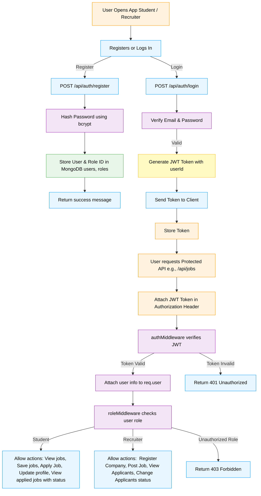

```mermaid
flowchart TD
    %% Define styles
    classDef api fill:#E8F6FF,stroke:#0099FF,stroke-width:1px,color:#000;
    classDef user fill:#FFF3E0,stroke:#FF9800,stroke-width:1px,color:#000;
    classDef db fill:#E8F5E9,stroke:#4CAF50,stroke-width:1px,color:#000;
    classDef middleware fill:#F3E5F5,stroke:#9C27B0,stroke-width:1px,color:#000;
    classDef jwt fill:#FFF9C4,stroke:#FBC02D,stroke-width:1px,color:#000;

    %% Flow starts
    A[User Opens App Student / Recruiter]:::user --> B[Registers or Logs In]:::api

    %% Registration branch
    B --> |Register| C[POST /api/auth/register]:::api
    C --> D[Hash Password using bcrypt]:::middleware
    D --> E[Store User & Role ID in MongoDB users, roles]:::db
    E --> F[Return success message]:::api

    %% Login branch
    B --> |Login| G[POST /api/auth/login]:::api
    G --> H[Verify Email & Password]:::middleware
    H --> |Valid| I[Generate JWT Token with userId]:::jwt
    I --> J[Send Token to Client]:::api
    J --> K[Store Token]:::user

    %% Token verification on request
    K --> L[User requests Protected API e.g., /api/jobs]:::user
    L --> M[Attach JWT Token in Authorization Header]:::user
    M --> N[authMiddleware verifies JWT]:::middleware
    N --> |Token Valid| O[Attach user info to req.user]:::middleware
    N --> |Token Invalid| P[Return 401 Unauthorized]:::api

    %% Role-based access
    O --> Q[roleMiddleware checks user role]:::middleware
    Q --> |Student| R[Allow actions: View jobs, Save jobs, Apply Job,  Update profile, View applied jobs with status]:::api
    Q --> |Recruiter| S[Allow actions:  Register Company, Post Job, View Applicants, Change Applicants status]:::api
    Q --> |Unauthorized Role| T[Return 403 Forbidden]:::api
```