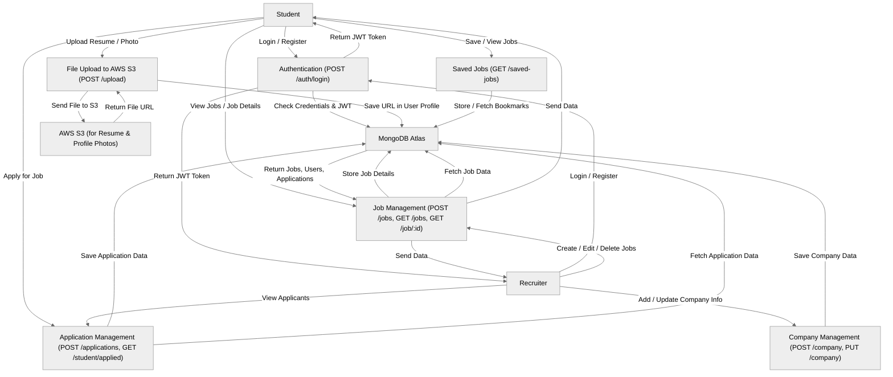

```mermaid
---
config:
  theme: neutral
---

flowchart TD
    %% external users
    Student["Student"]
    Recruiter["Recruiter"]

    %% main processes
    Auth["Authentication (POST /auth/login)"]
    CompanyProcess["Company Management (POST /company, PUT /company)"]
    JobProcess["Job Management (POST /jobs, GET /jobs, GET /job/:id)"]
    ApplicationProcess["Application Management (POST /applications, GET /student/applied)"]
    FileUpload["File Upload to AWS S3 (POST /upload)"]
    BookmarkProcess["Saved Jobs (GET /saved-jobs)"]

    %% data stores
    DB["MongoDB Atlas"]
    S3["AWS S3 (for Resume & Profile Photos)"]

    %% authentication
    Student -->|Login / Register| Auth
    Recruiter -->|Login / Register| Auth
    Auth -->|Check Credentials & JWT| DB
    Auth -->|Return JWT Token| Student
    Auth -->|Return JWT Token| Recruiter

    %% company management
    Recruiter -->|Add / Update Company Info| CompanyProcess
    CompanyProcess -->|Save Company Data| DB

    %% job management
    Recruiter -->|Create / Edit / Delete Jobs| JobProcess
    JobProcess -->|Store Job Details| DB
    Student -->|View Jobs / Job Details| JobProcess
    JobProcess -->|Fetch Job Data| DB

    %% applications
    Student -->|Apply for Job| ApplicationProcess
    ApplicationProcess -->|Save Application Data| DB
    Recruiter -->|View Applicants| ApplicationProcess
    ApplicationProcess -->|Fetch Application Data| DB

    %% file upload
    Student -->|Upload Resume / Photo| FileUpload
    FileUpload -->|Send File to S3| S3
    S3 -->|Return File URL| FileUpload
    FileUpload -->|Save URL in User Profile| DB

    %% bookmarks
    Student -->|Save / View Jobs| BookmarkProcess
    BookmarkProcess -->|Store / Fetch Bookmarks| DB

    %% returning data to ui
    DB -->|Return Jobs, Users, Applications| JobProcess
    JobProcess -->|Send Data| Student
    JobProcess -->|Send Data| Recruiter
```