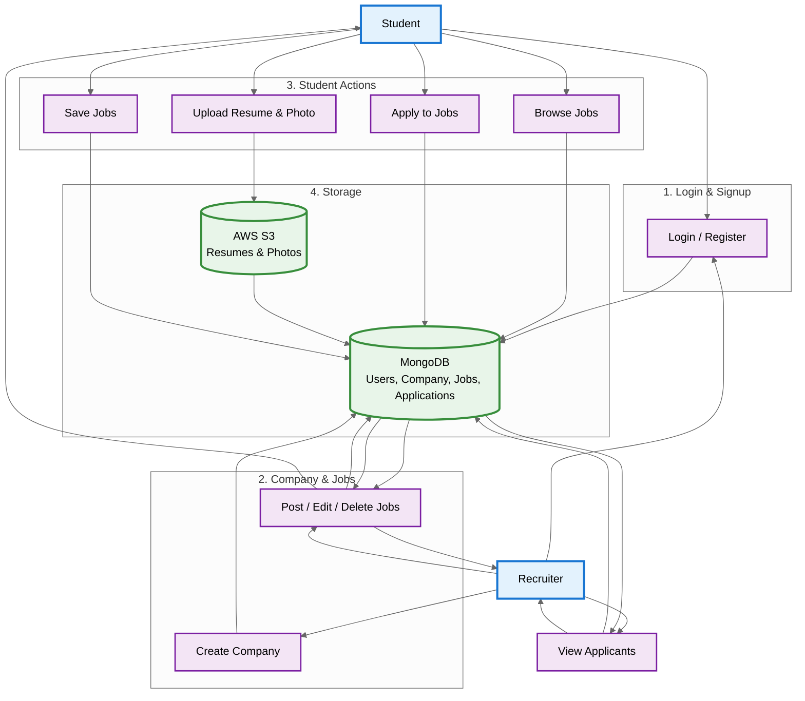

```mermaid
---
config:
  theme: neutral
---

flowchart TD
    %% Users
    A[Student] 
    B[Recruiter]

    %% Main Features
    subgraph "1. Login & Signup"
        Login[Login / Register]
    end

    subgraph "2. Company & Jobs"
        Company[Create Company]
        Jobs[Post / Edit / Delete Jobs]
    end

    subgraph "3. Student Actions"
        Browse[Browse Jobs]
        Apply[Apply to Jobs]
        Upload[Upload Resume & Photo]
        Save[Save Jobs]
    end

    subgraph "4. Storage"
        DB[(MongoDB<br>Users, Company, Jobs, Applications)]
        S3[(AWS S3<br>Resumes & Photos)]
    end

    %% Simple Flows
    A --> Login
    B --> Login
    Login --> DB

    B --> Company --> DB
    B --> Jobs --> DB

    A --> Browse --> DB
    A --> Apply --> DB
    A --> Upload --> S3 --> DB
    A --> Save --> DB

    B --> ViewApps[View Applicants] --> DB

    DB --> Jobs --> A
    DB --> Jobs --> B
    DB --> ViewApps --> B

    %% Beautiful Styling
    classDef user fill:#e3f2fd,stroke:#1976d2,stroke-width:3px,color:#000;
    classDef feature fill:#f3e5f5,stroke:#7b1fa2,stroke-width:2px;
    classDef storage fill:#e8f5e9,stroke:#388e3c,stroke-width:3px;
    
    class A,B user
    class Login,Company,Jobs,Browse,Apply,Upload,Save,ViewApps feature
    class DB,S3 storage
```