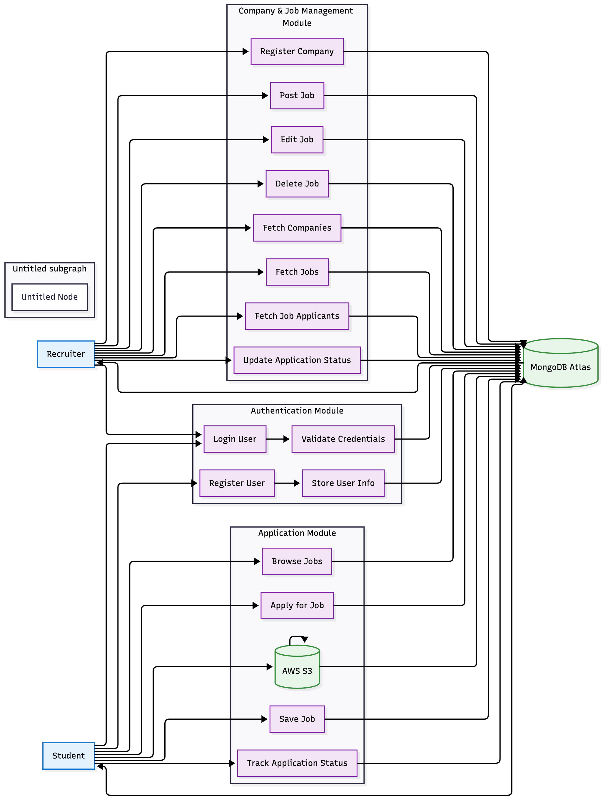

# Data Flow Diagrams

This section shows how data moves through the **Job Portal App** at different levels of detail — from a high-level system view to a detailed breakdown of key processes.

---

### Level 0 DFD
The Level 0 diagram represents the overall system as a single process interacting with — **Students**, **Recruiters**, **AWS S3**, **MongoDB Atlas**.  

  

### Level 1 DFD
This diagram breaks the system into key functional modules like Authentication, Company & Jobs, Student Actions, and Storage.

  

### Level 2 DFD
This level provides a detailed view of the internal operations inside each module.

  

