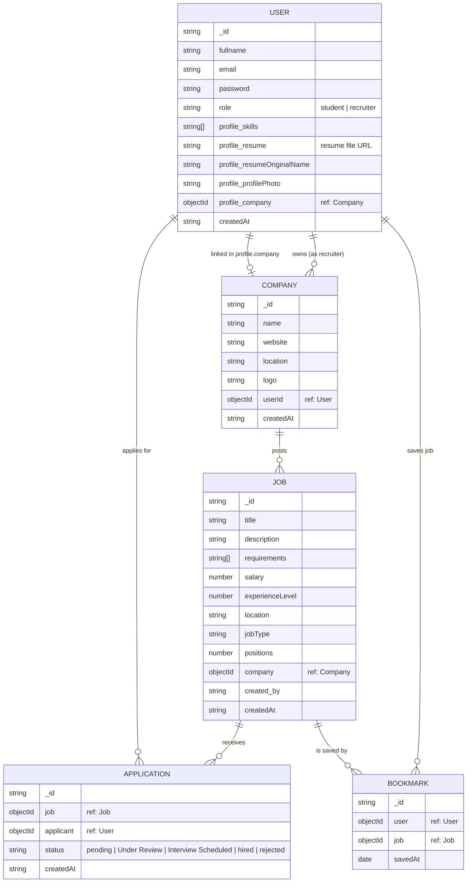

# Entity Relationship (ER) Diagram

This diagram represents the relationships between key entities in the Job Portal App database.

```mermaid
erDiagram

	USER {
		string _id  ""  
		string fullname  ""  
		string email  ""  
		string password  ""  
		string role  "student | recruiter"  
		string[] profile_skills  ""  
		string profile_resume  "resume file URL"  
		string profile_resumeOriginalName  ""  
		string profile_profilePhoto  ""  
		objectId profile_company  "ref: Company"  
		string createdAt  ""  
	}

	COMPANY {
		string _id  ""  
		string name  ""  
		string website  ""  
		string location  ""  
		string logo  ""  
		objectId userId  "ref: User"  
		string createdAt  ""  
	}

	JOB {
		string _id  ""  
		string title  ""  
		string description  ""  
		string[] requirements  ""  
		number salary  ""  
		number experienceLevel  ""  
		string location  ""  
		string jobType  ""  
		number positions  ""  
		objectId company  "ref: Company"  
		string created_by  ""  
		string createdAt  ""  
	}

	APPLICATION {
		string _id  ""  
		objectId job  "ref: Job"  
		objectId applicant  "ref: User"  
		string status  "pending | Under Review | Interview Scheduled | hired | rejected"  
		string createdAt  ""  
	}

	BOOKMARK {
		string _id  ""  
		objectId user  "ref: User"  
		objectId job  "ref: Job"  
		date savedAt  ""  
	}

	%% Relationships
	USER ||--o{ COMPANY : "owns (as recruiter)"
	COMPANY ||--o{ JOB : "posts"
	JOB ||--o{ APPLICATION : "receives"
	USER ||--o{ APPLICATION : "applies for"
	USER ||--o| COMPANY : "linked in profile.company"
	USER ||--o{ BOOKMARK : "saves job"
	JOB ||--o{ BOOKMARK : "is saved by"

```
