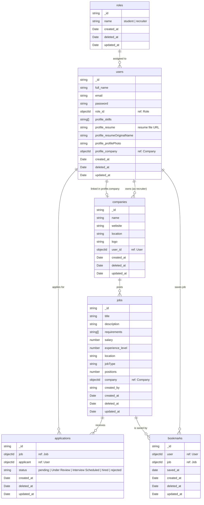

```mermaid
erDiagram
	users {
		string _id  ""  
		string full_name  ""  
		string email  ""  
		string password  ""  
		objectId role_id  "ref: Role"  
		string[] profile_skills  ""  
		string profile_resume  "resume file URL"  
		string profile_resumeOriginalName  ""  
		string profile_profilePhoto  ""  
		objectId profile_company  "ref: Company"  
		Date created_at  ""  
		Date deleted_at  ""  
		Date updated_at  ""  
	}

	roles {
		string _id  ""  
		string name  "student | recruiter"  
		Date created_at  ""  
		Date deleted_at  ""  
		Date updated_at  ""  
	}

	companies {
		string _id  ""  
		string name  ""  
		string website  ""  
		string location  ""  
		string logo  ""  
		objectId user_id  "ref: User"  
		Date created_at  ""  
		Date deleted_at  ""  
		Date updated_at  ""  
	}

	jobs {
		string _id  ""  
		string title  ""  
		string description  ""  
		string[] requirements  ""  
		number salary  ""  
		number experience_level  ""  
		string location  ""  
		string jobType  ""  
		number positions  ""  
		objectId company  "ref: Company"  
		string created_by  ""  
		Date created_at  ""  
		Date deleted_at  ""  
		Date updated_at  ""  
	}

	applications {
		string _id  ""  
		objectId job  "ref: Job"  
		objectId applicant  "ref: User"  
		string status  "pending | Under Review | Interview Scheduled | hired | rejected"  
		Date created_at  ""  
		Date deleted_at  ""  
		Date updated_at  ""  
	}

	bookmarks {
		string _id  ""  
		objectId user  "ref: User"  
		objectId job  "ref: Job"  
		date saved_at  ""  
		Date created_at  ""  
		Date deleted_at  ""  
		Date updated_at  ""  
	}

	roles||--o{users:"assigned to"
	users||--o{companies:"owns (as recruiter)"
	companies||--o{jobs:"posts"
	jobs||--o{applications:"receives"
	users||--o{applications:"applies for"
	users||--o|companies:"linked in profile.company"
	users||--o{bookmarks:"saves job"
	jobs||--o{bookmarks:"is saved by"

```