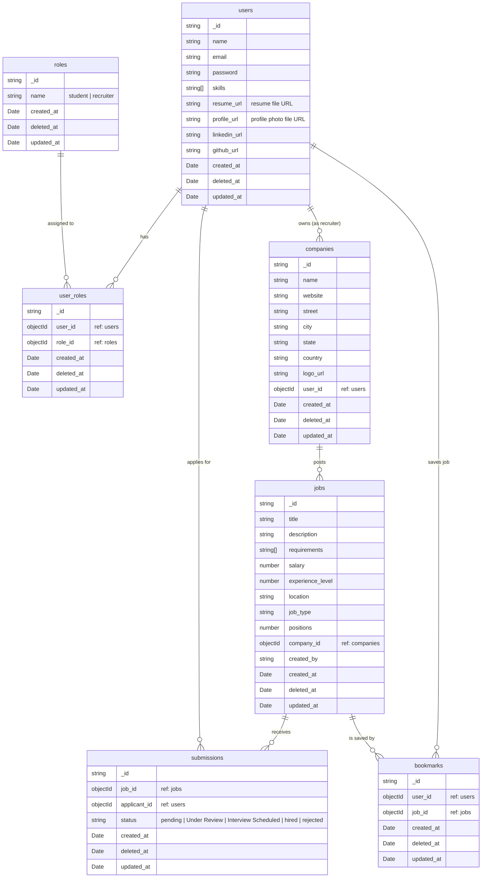

# Entity Relationship (ER) Diagram

This diagram shows how different collections in the **Job Portal App** are related to each other.  

---

```mermaid
erDiagram
	users {
		string _id  ""  
		string name  ""  
		string email  ""  
		string password  "" 
		%% skills, resume_url, profile_url will be in profile fields%% 
		string[] skills  ""  
		string resume_url  "resume file URL"  
		string profile_url "profile photo file URL"
		%% linkedin_url, github_url will be in social_links fields%% 
		string linkedin_url ""
		string github_url ""   
		Date created_at  ""  
		Date deleted_at  ""  
		Date updated_at  ""  
	}

	roles {
		string _id  ""  
		string name  "student | recruiter"  
		Date created_at  ""  
		Date deleted_at  ""  
		Date updated_at  ""  
	}

	user_roles {
		string _id  ""  
		objectId user_id  "ref: users"  
		objectId role_id  "ref: roles"  
		Date created_at  ""  
		Date deleted_at  ""  
		Date updated_at  ""  
	}

	companies {
		string _id  ""  
		string name  ""  
		string website  ""  
	    %% street, city, state, country will be in address fields%% 		
		string street ""
		string city ""
		string state ""
		string country ""  
		string logo_url  ""  
		objectId user_id  "ref: users"  
		Date created_at  ""  
		Date deleted_at  ""  
		Date updated_at  ""  
	}

	jobs {
		string _id  ""  
		string title  ""  
		string description  ""  
		string[] requirements  ""  
		number salary  ""  
		number experience_level  ""  
		string location  ""  
		string job_type  ""  
		number positions  ""  
		objectId company_id  "ref: companies"  
		string created_by  ""  
		Date created_at  ""  
		Date deleted_at  ""  
		Date updated_at  ""  
	}

	submissions {
		string _id  ""  
		objectId job_id  "ref: jobs"  
		objectId applicant_id  "ref: users"  
		string status  "pending | Under Review | Interview Scheduled | hired | rejected"  
		Date created_at  ""  
		Date deleted_at  ""  
		Date updated_at  ""  
	}

	bookmarks {
		string _id  ""  
		objectId user_id  "ref: users"  
		objectId job_id  "ref: jobs"  
		Date created_at  ""  
		Date deleted_at  ""  
		Date updated_at  ""  
	}

	%% Relationships
	users ||--o{ user_roles : "has"
	roles ||--o{ user_roles : "assigned to"
	users ||--o{ companies : "owns (as recruiter)"
	companies ||--o{ jobs : "posts"
	jobs ||--o{ submissions : "receives"
	users ||--o{ submissions : "applies for"
	users ||--o{ bookmarks : "saves job"
	jobs ||--o{ bookmarks : "is saved by"


```
