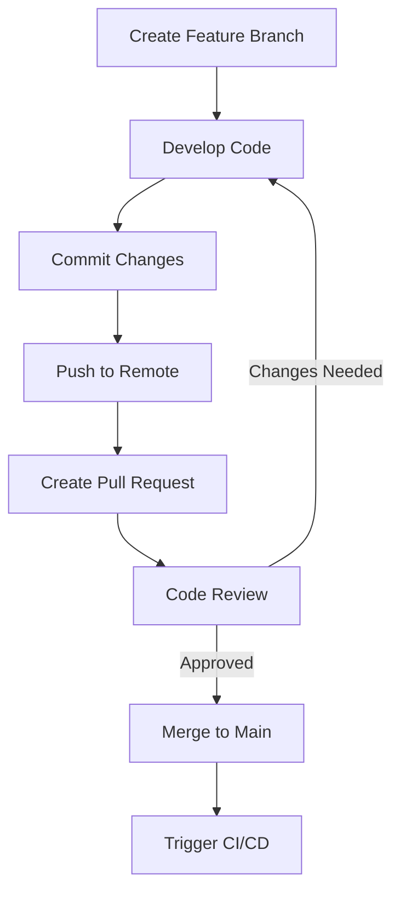
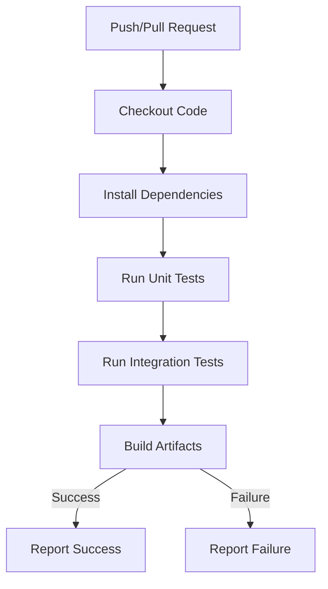
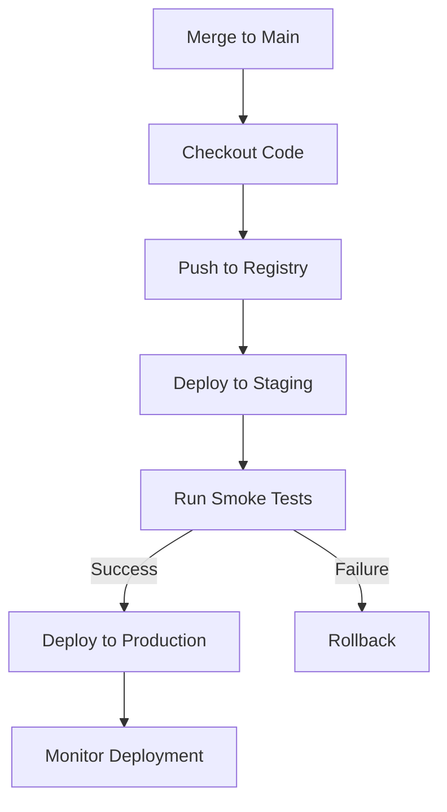
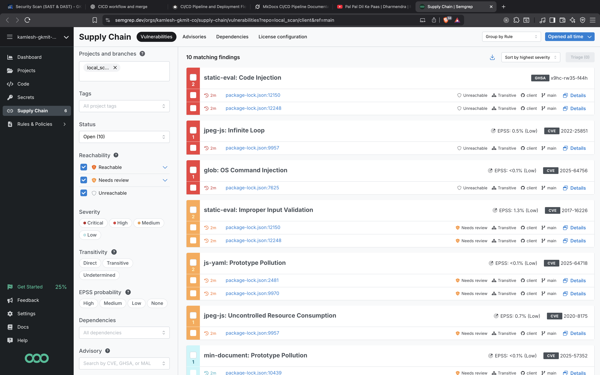
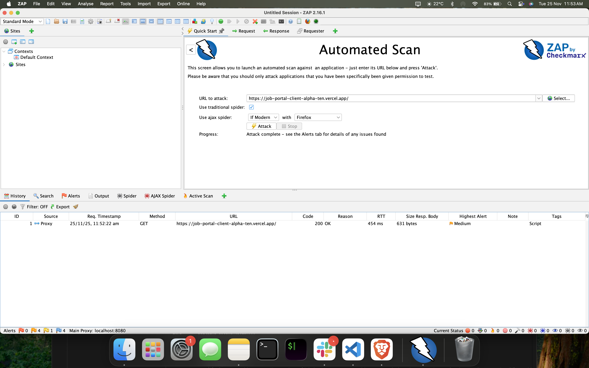

# CI/CD Pipeline and Deployment Flow

## Code Merge Workflow

The code merge workflow outlines the process for integrating changes into the main branch. It typically follows a feature branch model where we create branches for new features or bug fixes, submit pull requests, and merge after reviews and tests.

## CI Workflow

The Continuous Integration (CI) workflow automates the building, testing, and validation of code changes. It runs on every pull request and push to ensure code quality before merging.

## CD Workflow

The Continuous Deployment (CD) workflow handles the deployment of validated code to production or staging environments. It typically triggers after a successful merge to the main branch.

Security Scanning (SAST & DAST)
 
To ensure that our application remains safe and follows industry-standard security practices, we use both **SAST (Static Application Security Testing)** and **DAST (Dynamic Application Security Testing)** as part of our CI/CD pipeline.

---

## SAST – Static Application Security Testing

SAST scans the codebase **before execution**, helping identify insecure coding patterns, vulnerabilities, or bad practices early in the development cycle.

### SAST With Trivy
Trivy is easy to use and effective at detecting vulnerabilities in OS packages, application dependencies, and infrastructure-as-code (IaC) files.

  

### SAST With Semgrep

  

---

## DAST – Dynamic Application Security Testing

DAST scans the **running application** for real-world vulnerabilities by interacting with it like an external attacker.

### DAST Scans with OWASP ZAP

OWASP ZAP simulates attacks and analyzes the responses to highlight potential risks.

  

---

### DAST Scans with Akido

I also integrate Akido’s scanning suite, which performs additional checks not covered by ZAP.

  

---