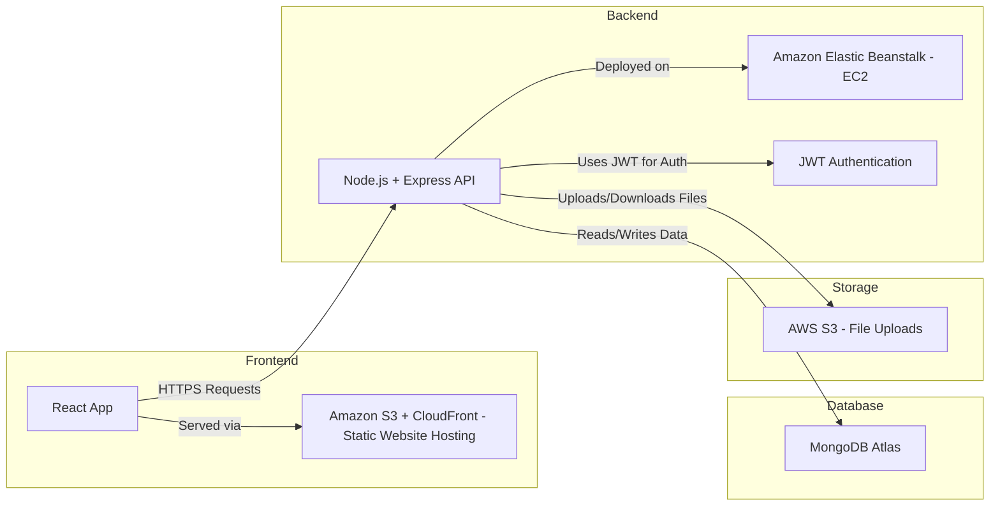

# System Architecture

---

## Tech Stack Overview

The Job Portal App uses the **MERN (MongoDB, Express, React, Node)** stack

## System Architecture Diagram

```mermaid
graph LR
    %% Frontend
    subgraph "Frontend"
        A[React App]
        S3FE[Amazon S3 + CloudFront - Static Website Hosting]
    end

    %% Backend
    subgraph "Backend"
        B[Node.js + Express API]
        EB[Amazon Elastic Beanstalk - EC2]
        J[JWT Authentication]
    end

    %% Database
    subgraph "Database"
        C[MongoDB Atlas]
    end

    %% File Storage
    subgraph "Storage"
        S3[AWS S3 - File Uploads]
    end

    %% Relationships
    A -->|HTTPS Requests| B
    A -->|Served via| S3FE
    B -->|Deployed on| EB
    B -->|Uses JWT for Auth| J
    B -->|Reads/Writes Data| C
    B -->|Uploads/Downloads Files| S3
```

