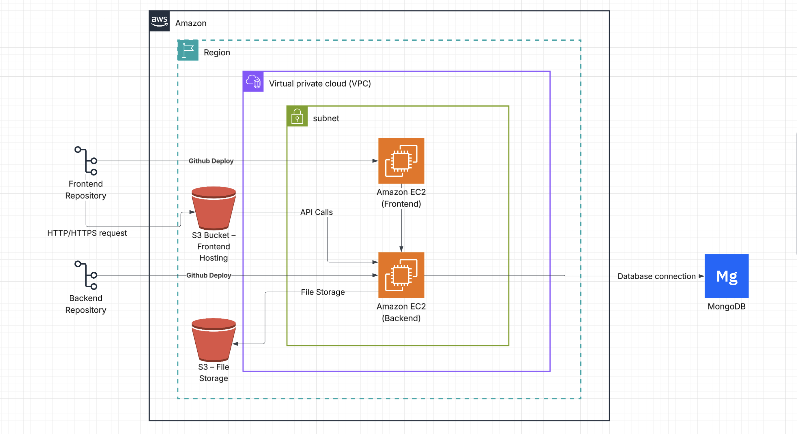

# System Architecture

This page shows the **system architecture** of the Job Portal App.  
  
The architecture mainly focuses on providing a scalable and secure environment using **AWS** and **cloud-based services**.

---

---

### 🧩 Explanation

- **Frontend (React + Vite):**  
  The user interface is built using React website.

- **Backend (Node.js + Express):**  
  The backend is deployed on an **AWS EC2 instance** inside a **VPC** (Virtual Private Cloud).  

- **Database (MongoDB Atlas):**  
  Stores all user, job, company, bookmarks and application data securely in the cloud.

- **File Storage (AWS S3):**  
  Used to store uploaded files like resumes and profile photos.  
  
- **Security:**  
  Authentication and Authorization are implemented using **JWT tokens**, ensuring only verified users can access protected routes.

---