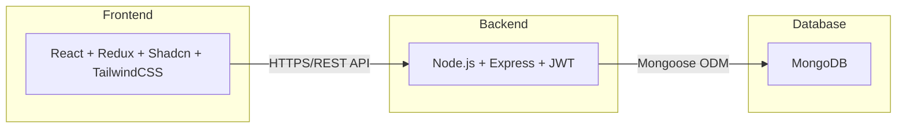

# System Architecture

---

## Tech Stack Overview

The Job Portal App uses the **MERN (MongoDB, Express, React, Node)** stack

## High Level Diagram

### Frontend
- **React + Vite:** Provides fast UI rendering and hot module replacement for rapid development.
- **Redux:** Manages global state across different components.
- **Tailwind CSS:** Used for responsive and modern design.
- **Shadcn/ui:** customizable component library used for accessible UI components (like modals, dropdowns, buttons, and inputs).

### Backend
- **Express.js:** Handles API routes and middleware logic.
- **Node.js:** Provides a runtime environment for server-side logic.
- **JWT Authentication:** Ensures secure login and role-based route protection.

### Database
- **MongoDB:** Stores users, jobs, and applications. Each recruiter’s jobs and corresponding applications are linked via object references.

---

## Deployment Structure

- **Frontend Deployment:** Deployed on **Vercel** for fast builds and global CDN delivery.  
- **Backend Deployment:** Hosted on **Render** for dynamic APIs.  
- **Database:** Managed on **MongoDB Atlas**, ensuring scalability and cloud reliability.

